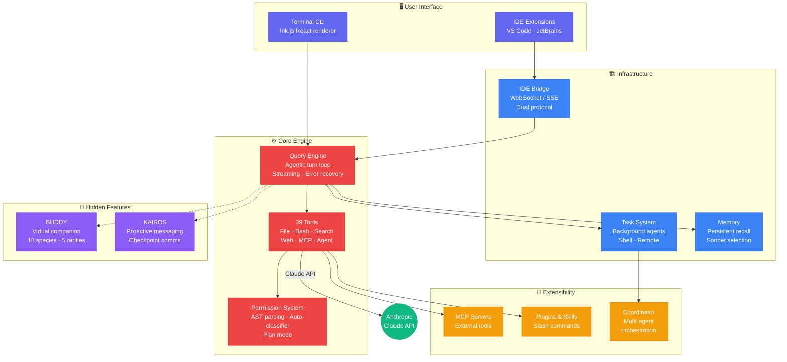
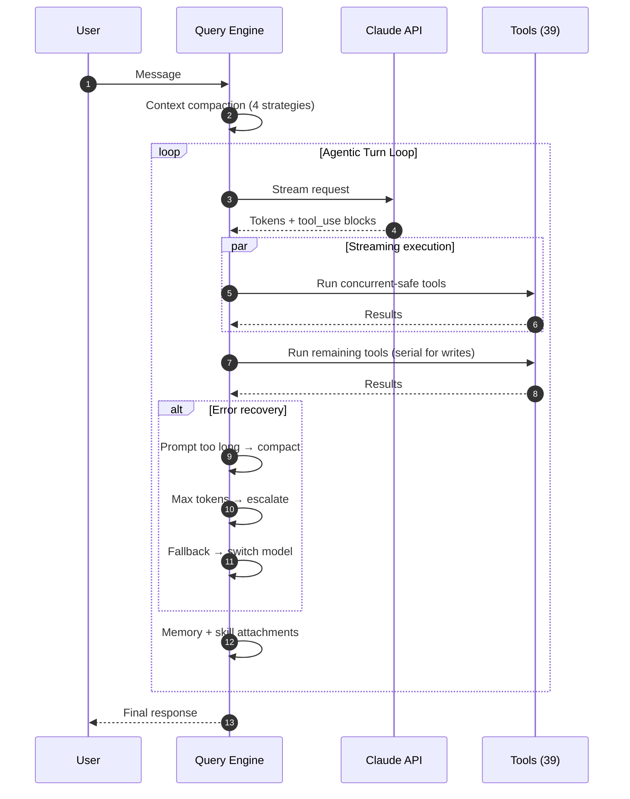

# Claude Code Internals

**A deep architecture analysis of Anthropic's AI coding CLI**

Based on the source code leaked via npm source maps on March 31, 2026

**[English](README.md)** | **[中文](README_zh.md)**

---

`~1,900 files` · `~513,000 lines` · `39 tools` · `36 modules` · `85+ hooks` · `146+ components` · `100+ commands`

## Architecture Overview

## Query Engine Flow

The core of Claude Code — an agentic turn loop with streaming tool execution, 4 context compaction strategies, and 7+ error recovery paths.

## What's Inside

### Analysis

| Document | What You'll Learn |
|----------|-------------------|
| [**Tool System Breakdown**](analysis/tools-breakdown.md) | 39 tools across 10 categories, multi-layer permission model (AST-parsed commands, auto-classifier, plan mode), fail-closed defaults |
| [**Hidden Features**](analysis/hidden-features.md) | **BUDDY** — deterministic virtual companion (Mulberry32 PRNG, 18 species, 5 rarity tiers, 1% shiny) and **KAIROS** — proactive messaging with append-only logging |
| [**Extra Modules**](analysis/extra-modules.md) | coordinator (multi-agent), tasks (background execution), memdir (persistent memory with Sonnet selection), **moreright** (mysterious internal-only stub) |

### Detailed Diagrams (Mermaid)

| Diagram | Description |
|---------|-------------|
| [Architecture (full detail)](diagrams/architecture-overview.mmd) | All 36 modules with dependency arrows, color-coded by layer |
| [Query Engine (full detail)](diagrams/query-engine-flow.mmd) | Complete call chain: entry → streaming → tool execution → error recovery → loop |
| [IDE Bridge Protocol](diagrams/ide-bridge.mmd) | v1 (WebSocket) / v2 (SSE) dual protocol, reconnection strategies, crash recovery |

### Articles

| Article | Audience |
|---------|----------|
| [**English article**](docs/article-en.md) (~1,800 words) | GitHub / dev.to — concise technical deep-dive |
| [**Chinese article**](docs/article-zh.md) (~2,300 words) | Juejin / Zhihu — detailed with more background context |

## Key Findings

**Permission system** — More complex than the LLM orchestration itself. Bash commands are AST-parsed to detect destructive operations. WebFetch uses hostname allowlists. A lightweight classifier auto-approves safe operations. Plan mode requires explicit approval for every tool call.

**Streaming tool execution** — `StreamingToolExecutor` runs concurrency-safe tools *while the LLM is still generating*, significantly reducing latency in multi-tool turns.

**Context management** — Four compaction strategies (micro, auto, reactive, context collapse) plus tool result budgeting. Context window management is not a solved problem — it's a continuous engineering effort.

**BUDDY** — A deterministic gacha system deriving unique ASCII companions from `userId` hash → Mulberry32 PRNG seed. Only the "soul" (name, personality) is persisted; "bones" (species, rarity, stats) regenerate from hash, preventing config-editing exploits.

**KAIROS** — Routes all visible output through `SendUserMessage` tool. Text outside tool calls goes to a low-visibility detail view. This enables proactive status updates and checkpoint-based communication.

**moreright/** — A 25-line no-op stub that replaces an internal Anthropic feature. Gated by `"external" === 'ant'` (always false). The `onBeforeQuery` / `onTurnComplete` interface reveals where internal tooling hooks into the main loop.

## Background

On March 31, 2026, [Chaofan Shou](https://x.com/shoucccc) discovered that Anthropic's Claude Code CLI had its full source code exposed via source maps bundled in the npm package. Source maps — normally a development-only debugging aid — were accidentally included in the production build, allowing anyone to reconstruct the original TypeScript source.

This repo contains **only original analysis and documentation** — no leaked source code is included.

## License

This analysis is original work. The analyzed source code belongs to Anthropic.
