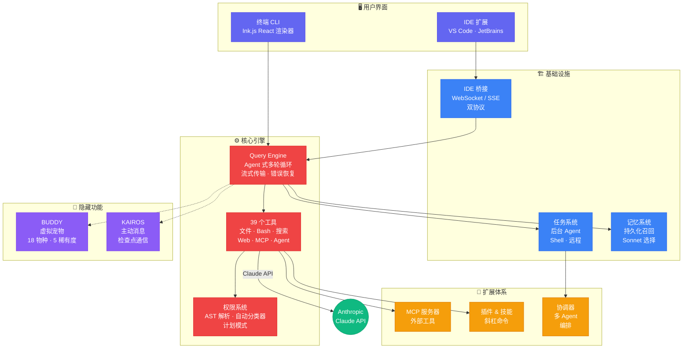
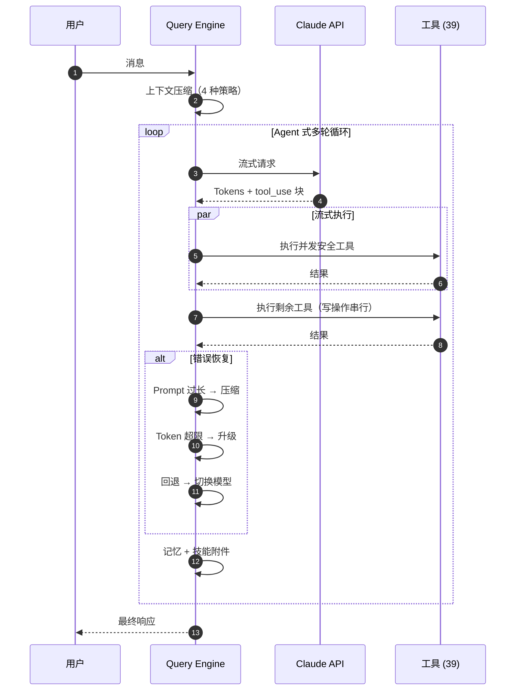

# Claude Code 架构拆解

**Anthropic AI 编程 CLI 的深度架构分析**

基于 2026 年 3 月 31 日通过 npm source map 泄露的源码

**[English](README.md)** | **[中文](README_zh.md)**

---

`~1,900 文件` · `~513,000 行代码` · `39 个工具` · `36 个模块` · `85+ Hooks` · `146+ 组件` · `100+ 命令`

## 架构总览

## Query Engine 流程

Claude Code 的核心 — Agent 式多轮循环，支持流式工具执行、4 种上下文压缩策略、7+ 种错误恢复路径。

## 内容导航

### 分析文档

| 文档 | 你将了解到 |
|------|-----------|
| [**工具系统拆解**](analysis/tools-breakdown.md) | 39 个工具、10 个类别、多层权限模型（AST 命令解析、自动分类器、计划模式）、fail-closed 默认值 |
| [**隐藏功能分析**](analysis/hidden-features.md) | **BUDDY** — 确定性虚拟宠物（Mulberry32 PRNG、18 物种、5 稀有度、1% 闪光）和 **KAIROS** — 主动消息系统 + 追加写入日志 |
| [**补充模块分析**](analysis/extra-modules.md) | coordinator（多 Agent 协调）、tasks（后台执行）、memdir（持久记忆 + Sonnet 选择）、**moreright**（神秘的内部功能存根） |

### 详细架构图（Mermaid）

| 图表 | 说明 |
|------|------|
| [架构图（完整版）](diagrams/architecture-overview.mmd) | 全部 36 个模块，按层级着色，依赖关系 |
| [Query Engine（完整版）](diagrams/query-engine-flow.mmd) | 完整调用链：入口 → 流式传输 → 工具执行 → 错误恢复 → 循环 |
| [IDE 桥接协议](diagrams/ide-bridge.mmd) | v1（WebSocket）/ v2（SSE）双协议、重连策略、崩溃恢复 |

### 文章

| 文章 | 适用读者 |
|------|---------|
| [**英文文章**](docs/article-en.md)（约 1,800 词） | GitHub / dev.to — 简洁精准的技术深入 |
| [**中文文章**](docs/article-zh.md)（约 2,300 字） | 掘金 / 知乎 — 详细展开，含更多背景解释 |

## 关键发现

**权限系统** — 复杂度可能超过 LLM 编排本身。Bash 命令通过 AST 解析检测破坏性操作。WebFetch 使用域名白名单。轻量级分类器自动批准安全操作。计划模式要求每个工具调用都经过显式批准。

**流式工具执行** — `StreamingToolExecutor` 在 LLM *还在生成的时候*就开始执行并发安全的工具，显著降低多工具轮次的延迟。

**上下文管理** — 四种压缩策略（微压缩、自动压缩、反应式压缩、上下文折叠）+ 工具结果预算。上下文窗口管理不是"解决了就完事"的问题，而是需要持续迭代的工程挑战。

**BUDDY** — 确定性抽卡系统，通过 `userId` 哈希 → Mulberry32 PRNG 种子生成唯一 ASCII 宠物。只有"灵魂"（名字、性格）持久化，"骨骼"（物种、稀有度、属性）从哈希重新生成，防止配置文件作弊。

**KAIROS** — 所有可见输出必须通过 `SendUserMessage` 工具发送。工具调用之外的文本只进入低可见度详情视图。这使得主动状态更新和检查点式通信成为可能。

**moreright/** — 一个 25 行的 no-op 存根，替代 Anthropic 内部功能。通过 `"external" === 'ant'`（永远为 `false`）门控。`onBeforeQuery` / `onTurnComplete` 接口揭示了内部工具在主循环中的挂载点。

## 背景

2026 年 3 月 31 日，[Chaofan Shou](https://x.com/shoucccc) 发现 Anthropic 的 Claude Code CLI 将完整源码通过 npm 包中的 source map 文件意外暴露。Source map 本应仅用于开发调试，却被打包进了生产版本，任何人都能据此还原原始 TypeScript 源码。

本仓库 **仅包含原创分析与文档**，不包含泄露的源代码。

## 许可

本分析为原创内容。被分析的源代码归 Anthropic 所有。
